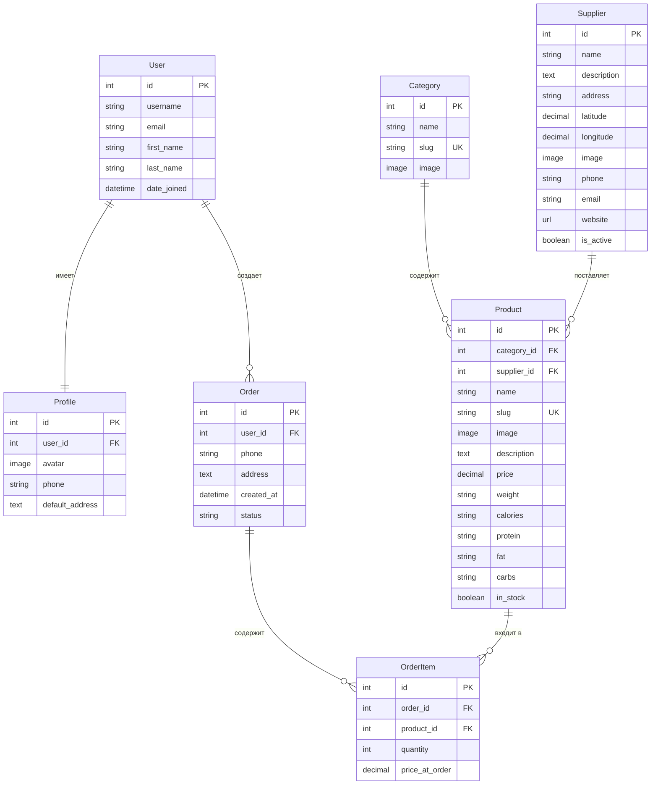

### GreenPleasure - Описание Django проекта ###
## Название и назначение сайта

**Название сайта:** GreenPleasure - Эко-магазин

**Назначение сайта:**

GreenPleasure - это учебный интернет-магазин, предназначенный для продажи экологически чистых продуктов питания с возможностью регистрации пользователей, добавления товаров в корзину и оформления заказов. Проект охватывает ключевые концепции веб-разработки на Django, включая работу с моделями, представлениями, шаблонами, формами, аутентификацией и сессиями. **Дополнительно** реализована интерактивная карта поставщиков с использованием библиотеки Leaflet.js, демонстрирующая интеграцию внешних JavaScript-библиотек и работу с геолокационными данными.

## Основные требования и структура сайта

### Функциональные требования

#### Для гостей сайта

1. Просмотр каталога товаров с фильтрацией по категориям и поставщикам
2. Добавление товаров в сессионную корзину
3. Регистрация и авторизация пользователей
4. Просмотр детальной информации о товарах
5. **Просмотр интерактивной карты поставщиков с геолокацией**
6. **Фильтрация товаров по поставщикам через карту**

#### Для зарегистрированных пользователей

1. Все возможности гостей
2. Оформление заказов с предзаполнением контактных данных
3. Просмотр истории заказов
4. Редактирование профиля (телефон, адрес, аватар)

#### Для администраторов

1. Управление товарами, категориями, поставщиками и заказами через админ-панель
2. Изменение статусов заказов
3. Загрузка товаров через команду управления
4. Добавление и редактирование поставщиков с указанием координат для карты

### Нефункциональные требования

#### Технические

1. Использование Django 5.2.9
2. База данных SQLite (для разработки)
3. Интерфейс на Bootstrap 5
4. Локализация интерфейса на русский язык
5. Хранение медиа-файлов в локальной файловой системе
6. Использование Leaflet.js для интерактивных карт (OpenStreetMap тайлы)
7. API endpoints для получения данных в формате JSON

## Древовидная структура Django проекта

```
GreenPleasure (Django проект)
│
├── ecoshop/ (главный проект)
│   ├── settings.py - настройки проекта (INSTALLED_APPS, DATABASES, TEMPLATES, STATIC/MEDIA)
│   ├── urls.py - корневые URL-маршруты (admin/, accounts/, orders/, products/)
│   └── wsgi.py - WSGI конфигурация
│
├── accounts/ (приложение: управление пользователями)
│   ├── models.py → Profile (расширение User: OneToOne связь)
│   ├── views.py → RegisterView, CustomLoginView, CustomLogoutView, ProfileView, ProfileUpdateView
│   ├── urls.py → /accounts/register/, /accounts/login/, /accounts/logout/, /accounts/profile/, /accounts/profile/edit/
│   ├── forms.py → CustomUserCreationForm, ProfileUpdateForm
│   └── templates/accounts/ → register.html, login.html, profile.html, profile_edit.html
│
├── orders/ (приложение: корзина и заказы)
│   ├── models.py → Order (ForeignKey → User), OrderItem (ForeignKey → Order, Product)
│   ├── views.py → cart_add, cart_remove, cart_detail, checkout, OrderListView, OrderDetailView
│   ├── urls.py → /orders/cart/, /orders/cart/add/<id>/, /orders/cart/remove/<id>/, /orders/checkout/, /orders/orders/, /orders/orders/<id>/
│   ├── context_processors.py → cart_context_processor (для отображения корзины в навигации)
│   ├── mixins.py → LoginRequiredMixinWithMessage
│   └── templates/orders/ → cart.html, checkout.html, order_list.html, order_detail.html
│
└── products/ (приложение: каталог товаров)
    ├── models.py → Category, Product (ForeignKey → Category, ForeignKey → Supplier), Supplier (геолокация)
    ├── views.py → ProductListView (с фильтрацией по категориям и поставщикам), ProductDetailView, SupplierMapView, suppliers_json (API)
    ├── urls.py → / (список товаров), /<slug>/ (детали товара), /suppliers/map/ (карта), /suppliers/json/ (API)
    ├── management/commands/load_products.py → команда загрузки товаров из JSON
    └── templates/products/ → list.html, detail.html, supplier_map.html (интерактивная карта)
```

## Базовый макет страницы

### Навигационная панель (navbar)

- Логотип и название сайта (GreenPleasure)
- Ссылка на каталог товаров
- Ссылка на карту поставщиков
- Условные элементы:
  - Для гостей: "Войти", "Регистрация", иконка корзины
  - Для пользователей: "Личный кабинет", "Выход", иконка корзины

### Основное содержимое

- Блок для отображения сообщений (success/error/info)
- Контент страницы (зависит от текущего URL)

### Футер

- Информация о копирайте

## Структура шаблонов и статичных объектов

### Структура шаблонов

```
templates/
├── base.html (базовый шаблон)
├── accounts/
│   ├── login.html (страница входа)
│   ├── profile.html (профиль пользователя)
│   ├── profile_edit.html (редактирование профиля)
│   └── register.html (регистрация)
├── orders/
│   ├── cart.html (корзина)
│   ├── checkout.html (оформление заказа)
│   ├── order_detail.html (детали заказа)
│   └── order_list.html (список заказов)
└── products/
    ├── detail.html (детали товара)
    ├── list.html (список товаров)
    └── supplier_map.html (интерактивная карта поставщиков с Leaflet.js)
```

### Статичные объекты

```
static/
└── css/
    └── style.css (кастомные стили)
```

### Схема наследования шаблонов

Все шаблоны наследуются от `base.html`, который определяет общую структуру страницы.

## Ключевые теги в шаблонах

### base.html

- `` - заголовок страницы
- `` - основное содержимое
- `` - дополнительные скрипты
- `` - условие для авторизованных пользователей
- `` - отображение сообщений
- `` - генерация URL

### products/list.html

- `` - итерация по товарам
- `` - проверка наличия изображения
- `` - проверка наличия товара
- `` - защита от CSRF

### products/detail.html

- `` - проверка наличия товара
- `` - защита от CSRF

### orders/cart.html

- `` - итерация по элементам корзины
- `` - проверка авторизации для оформления заказа

### orders/checkout.html

- `` - защита от CSRF

### accounts/register.html

- `` - защита от CSRF
- `` - отображение ошибок форм

### accounts/profile.html

- `` - проверка наличия аватара
- `` - итерация по заказам пользователя

### products/supplier_map.html

- `` - подключение Leaflet.js библиотеки
- JavaScript fetch API - загрузка данных поставщиков через AJAX
- `L.map()` - инициализация интерактивной карты
- `L.marker()` - создание маркеров на карте
- Модальные окна Bootstrap - отображение детальной информации
- Интеграция с фильтрацией товаров через URL параметры

## Модели проекта и ER-диаграмма

Проект состоит из трех основных приложений, каждое из которых содержит свои модели:

### Приложение products

- Category - категории товаров
- Product - товары
- Supplier - поставщики товаров с геолокацией

### Приложение orders

- Order - заказы пользователей
- OrderItem - элементы заказов

### Приложение accounts

- Profile - профили пользователей (расширение стандартной модели User)

### ER-диаграмма



### Описание связей между моделями

| Связь | Тип | Описание | On Delete |
|-------|-----|----------|----------|
| **User ↔ Profile** | OneToOne | Один пользователь имеет один профиль | CASCADE |
| **User ↔ Order** | OneToMany | Один пользователь может создать множество заказов | CASCADE |
| **Category ↔ Product** | OneToMany | Одна категория содержит множество товаров | CASCADE |
| **Supplier ↔ Product** | OneToMany | Один поставщик поставляет множество товаров | SET_NULL |
| **Order ↔ OrderItem** | OneToMany | Один заказ содержит множество элементов | CASCADE |
| **Product ↔ OrderItem** | OneToMany | Один товар может входить в множество элементов заказов | CASCADE |

## Поля моделей проекта

### Модель Category (Категория товаров)

1. **name** - название категории (строка до 100 символов), например "Овощи", "Фрукты"
2. **slug** - уникальный URL-идентификатор категории (строка до 100 символов), используется для формирования ссылок
3. **image** - необязательное изображение категории, хранится в папке categories/

### Модель Product (Товар)

1. **category** - ссылка на категорию товара (внешний ключ к модели Category)
2. **supplier** - ссылка на поставщика товара (внешний ключ к модели Supplier, необязательное поле)
3. **name** - название товара (строка до 200 символов), например "Свежая морковь"
4. **slug** - уникальный URL-идентификатор товара (строка до 200 символов)
5. **image** - необязательное изображение товара, хранится в папке products/
6. **description** - текстовое описание товара
7. **price** - цена товара в формате десятичного числа с двумя знаками после запятой
8. **weight** - вес упаковки товара (строка до 50 символов), например "1 кг"
9. **calories** - калорийность на 100г (строка до 50 символов), например "35 ккал"
10. **protein** - содержание белков на 100г (строка до 50 символов), например "1.3г"
11. **fat** - содержание жиров на 100г (строка до 50 символов), например "0.1г"
12. **carbs** - содержание углеводов на 100г (строка до 50 символов), например "7.2г"
13. **in_stock** - булево значение, указывающее наличие товара на складе

### Модель Supplier (Поставщик)

1. **name** - название поставщика (строка до 200 символов)
2. **description** - описание поставщика (текстовое поле)
3. **address** - адрес поставщика (строка до 300 символов)
4. **latitude** - широта для геолокации (DecimalField, 9 цифр, 6 знаков после запятой)
5. **longitude** - долгота для геолокации (DecimalField, 9 цифр, 6 знаков после запятой)
6. **image** - необязательное изображение поставщика, хранится в папке suppliers/
7. **phone** - необязательный телефон поставщика (строка до 20 символов)
8. **email** - необязательный email поставщика
9. **website** - необязательный сайт поставщика (URL)
10. **is_active** - булево значение, указывающее активность поставщика

### Модель Order (Заказ)

1. **user** - ссылка на пользователя, сделавшего заказ (внешний ключ к стандартной модели User)
2. **phone** - телефон для связи по заказу (строка до 20 символов)
3. **address** - адрес доставки (текстовое поле)
4. **created_at** - дата и время создания заказа (автоматически устанавливается при создании)
5. **status** - статус заказа с выбором из трех значений: "новый", "подтвержден", "выполнен"

### Модель OrderItem (Элемент заказа)

1. **order** - ссылка на заказ (внешний ключ к модели Order)
2. **product** - ссылка на товар (внешний ключ к модели Product)
3. **quantity** - количество единиц товара в заказе (целое положительное число)
4. **price_at_order** - цена товара на момент оформления заказа (фиксируется при создании элемента заказа)

### Модель Profile (Профиль пользователя)

1. **user** - ссылка на пользователя (один к одному с моделью User)
2. **avatar** - необязательное изображение аватара пользователя, хранится в папке avatars/
3. **phone** - необязательный телефон пользователя (строка до 20 символов)
4. **default_address** - необязательный адрес по умолчанию (текстовое поле)

### Связи между моделями

1. **Category ↔ Product**: Одна категория может содержать множество товаров (один ко многим)
2. **Supplier ↔ Product**: Один поставщик может поставлять множество товаров (один ко многим)
3. **User ↔ Profile**: Один пользователь имеет один профиль (один к одному)
4. **User ↔ Order**: Один пользователь может сделать множество заказов (один ко многим)
5. **Order ↔ OrderItem**: Один заказ может содержать множество элементов (один ко многим)
6. **Product ↔ OrderItem**: Один товар может входить в множество элементов заказов (один ко многим)

### Классы Meta (метаданные моделей)

#### Для Category

- Отображаемое имя: "Категория" (единственное число) и "Категории" (множественное число)
- Сортировка по названию категории

#### Для Product

- Отображаемое имя: "Товар" (единственное число) и "Товары" (множественное число)
- Сортировка по названию товара

#### Для Order

- Отображаемое имя: "Заказ" (единственное число) и "Заказы" (множественное число)
- Сортировка по дате создания в обратном порядке (новые заказы первыми)

#### Для OrderItem

- Отображаемое имя: "Элемент заказа" (единственное число) и "Элементы заказа" (множественное число)

#### Для Profile

- Отображаемое имя: "Профиль" (единственное число) и "Профили" (множественное число)

#### Для Supplier

- Отображаемое имя: "Поставщик" (единственное число) и "Поставщики" (множественное число)
- Сортировка по названию поставщика

## Дополнительный функционал: Интерактивная карта поставщиков

### Описание

Реализована интерактивная карта поставщиков, позволяющая визуализировать географическое расположение всех поставщиков экологически чистых продуктов на карте. Функционал демонстрирует интеграцию внешних JavaScript-библиотек с Django и работу с геолокационными данными.

### Технологии

1. Leaflet.js - открытая JavaScript-библиотека для интерактивных карт (версия 1.9.4)
2. OpenStreetMap - бесплатные картографические тайлы
3. Fetch API - для получения данных с сервера в формате JSON
4. Bootstrap 5 - для модальных окон и стилизации интерфейса

### Реализация

1. Модель Supplier хранит координаты (latitude, longitude) для каждого поставщика
2. API endpoint (suppliers_json) возвращает данные всех активных поставщиков в формате JSON
3. Frontend использует Leaflet.js для создания интерактивной карты
4. Маркеры на карте отображают местоположение каждого поставщика
5. При клике на маркер открывается popup с краткой информацией
6. Список поставщиков слева позволяет быстро перейти к нужному поставщику
7. Модальное окно показывает детальную информацию о поставщике
8. Ссылки позволяют фильтровать товары по выбранному поставщику

### Функциональность карты

1. Отображение всех активных поставщиков на интерактивной карте
2. Автоматическое масштабирование для показа всех маркеров
3. Клик по маркеру - открытие popup с информацией
4. Клик по поставщику в списке - центрирование карты и открытие детальной информации
5. Модальное окно с полной информацией о поставщике (адрес, контакты, количество товаров)
6. Переход к товарам поставщика через фильтр в каталоге
7. Интеграция с каталогом товаров - фильтрация по поставщикам

### URL-маршруты

1. `/suppliers/map/` - страница с интерактивной картой поставщиков
2. `/suppliers/json/` - API endpoint для получения данных поставщиков в JSON

### Представления

1. SupplierMapView (TemplateView) - отображение страницы с картой
2. suppliers_json (function view) - API endpoint, возвращает JSON с данными поставщиков

### Оптимизация

1. Использование annotate(Count('products')) для подсчета товаров без N+1 запросов
2. select_related для оптимизации запросов к связанным моделям
3. Кэширование данных поставщиков на клиенте после загрузки

### Интеграция с каталогом

1. Фильтрация товаров по поставщикам в ProductListView
2. Отображение информации о поставщике на странице товара
3. Ссылки для перехода к товарам конкретного поставщика
4. Фильтры по поставщикам в каталоге товаров
